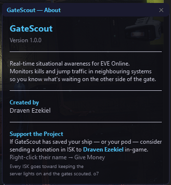

# GateScout

> Real-time situational awareness for EVE Online — know what's waiting on the other side of the gate.

---

## What is GateScout?

GateScout is a lightweight Windows overlay that sits on top of EVE Online and gives you live intelligence on every system reachable in a single jump from your current location.

When you're flying through New Eden, the biggest risk is what you *don't* know. GateScout pulls live data from CCP's ESI API and zKillboard to show you kills per hour and jump traffic for all neighbouring systems — so you can make informed decisions before you commit to a gate.

### Features

- **Live kill tracking** — ships and pods destroyed in the last hour, per system
- **Jump traffic** — how busy each gate is right now
- **Security status** — colour-coded high/low/null at a glance
- **Kill details** — click any system to see exactly what was destroyed, where, and by whom
- **Kill summary** — full breakdown per kill: victim, corp, alliance, ISK value, final blow attacker, and fleet composition
- **Gate proximity** — kills are classified as near a specific stargate or deep space, so you can spot gate camps instantly
- **Sound alerts** — an audio beep when new kills appear in a neighbouring system between refreshes
- **Always on top** — frameless transparent overlay, drag it anywhere on screen
- **Resizable windows** — every panel can be resized or reset to default
- **Collapse mode** — double-click the title bar to shrink the overlay to a single bar

---

## Screenshots

### Main Overlay

### Kill List

### Kill Details

### Help

### About

---

## Installation

1. Download the latest installer from the [Releases](https://github.com/nbisschoff/GateScout/releases) page
2. Run `GateScout_Setup_x.x.x.exe` — no admin rights required
3. Follow the installer (Next → Install → Finish)
4. Launch GateScout from the Start Menu or desktop shortcut
5. Click **Login** and authenticate with your EVE Online account

---

## How to Use

| Element | Meaning |
|---|---|
| ◉ System name at top | Your current system. Coloured + kill count if kills detected. Click to see details. |
| Underlined system in table | Kills detected — click to open the Kill List |
| **Sec** column | Security status: 🟢 ≥0.5 high-sec · 🟡 0.1–0.4 low-sec · 🔴 ≤0.0 null/wormhole |
| **Kills/hr** | Ships and pods destroyed in the last hour |
| **Jumps/hr** | Player jump traffic through that system |
| Yellow location in Kill List | Kill happened near a stargate — possible camp |
| ♪ button | Mute / unmute sound alerts |
| ⓘ button | About, version, and donation info |
| ? button | Full help and feature guide |
| ↺ button | Reset window to default size |
| Double-click title bar | Collapse overlay to header only |

**Kill colours:**
- 🟢 Green — 0 kills, looks clear
- 🟡 Yellow — 1–2 kills, exercise caution
- 🟠 Orange — 3–4 kills, hostile activity likely
- 🔴 Red — 5+ kills, danger

**Data refreshes every 30 seconds.** ESI data can lag a few minutes behind the in-game map — this is a CCP API limitation, not a bug.

---

## Requirements

- Windows 10 or 11
- An EVE Online account
- Internet connection

No Python installation required — GateScout is fully self-contained.

---

## Data Sources

- **[ESI (EVE Swagger Interface)](https://esi.evetech.net)** — CCP's official API for location, kills, jumps, and universe data
- **[zKillboard](https://zkillboard.com)** — community killboard for detailed kill records

---

## Support the Project

GateScout is free to use. If it has saved your ship — or your pod — consider sending a donation in ISK in-game.

**Send ISK to: `Draven Ezekiel`**

Right-click the name in-game → Give Money. Every ISK is appreciated. o7

---

## Developer

Created by **Draven Ezekiel** — an EVE Online pilot who got tired of jumping blind.

- GitHub: [nbisschoff](https://github.com/nbisschoff)

---

## License

This project is provided as-is for personal use. Not affiliated with CCP Games.
EVE Online and all related assets are the property of CCP hf.
